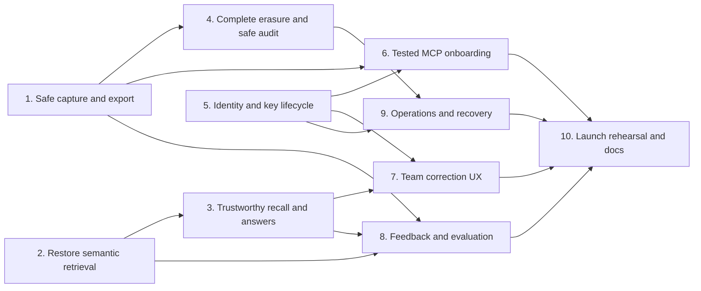

# Shared Living Memory Team Pilot Readiness Implementation Plan

> **For agentic workers:** REQUIRED SUB-SKILL: Use superpowers:subagent-driven-development (recommended) or superpowers:executing-plans to implement this plan task-by-task.

**Goal:** Make Shared Living Memory safe, operable, understandable, and measurable for a 3–5 person internal team pilot, then produce enough evidence to decide whether to expand, revise, or stop.

**Architecture:** Keep D1 as the single durable knowledge authority, Vectorize as a rebuildable retrieval index, and the existing Worker as the only application/API boundary. Repair privacy, retrieval truth, identity, erasure, and recovery before adding a thin pilot-measurement loop. Do not introduce another memory engine, provider abstraction, analytics service, or autonomous knowledge layer for the pilot.

**Tech Stack:** Cloudflare Workers, D1, Vectorize, Workers AI, the existing KV/OAuth wrapper with OAuth issuance disabled for the pilot, TypeScript, the existing MCP SDK and Agents package, Vitest, shell/PowerShell onboarding scripts, and the existing static dashboard.

## Global Constraints

- This is an implementation plan and readiness report. It does not authorize deployment, production data mutation, credential rotation, new paid services, or inviting teammates.
- Team-pilot readiness is different from broad production readiness. The cohort is 3–5 trusted internal users for 15 business days.
- New human memories are private by default. Publishing to the team is always deliberate and visible.
- D1 remains authoritative. Vectorize can be completely rebuilt from current D1 state.
- Relevance, retention, and factual truth remain separate concepts. A thumbs-up must never promote a claim's epistemic status.
- Logs, audits, and metrics store identifiers, result counts, timing, hashes, and reason codes—not memory bodies, query text, credentials, or model prompts.
- Pilot scope is the dashboard plus tested remote MCP access. Notion, browser bookmarklets, iOS templates, Obsidian, CLI claims, autonomous nightly writes, and external users are excluded unless this plan explicitly graduates them.
- No code is copied from Hindsight, Hermes LCM, or listed providers. Their contracts are design references only.
- Use existing modules and native Cloudflare capabilities before adding code or dependencies.
- Every security or privacy fix ships with the smallest runnable regression that proves the former failure is closed.

---

## 1. Executive Decision

### Current verdict: foundation-rich, pilot-not-ready

Shared Living Memory already has substantial foundations: personal and service identities, owner/public authorization, versioned entries, immutable episodes, bitemporal lookup, history/restore, citations, graph primitives, contradiction proposals, Notion mirroring, and mandatory audit for governed service actions.

The team should **not** put real shared knowledge into the current deployment yet. The audit found release-blocking failures in privacy defaults, export, semantic retrieval, recall truth, MCP onboarding, first-admin creation, erasure, and recovery. Several failures are silent: the dashboard can say a failed capture was kept, and production semantic filtering currently returns no candidates without declaring itself unavailable.

The system becomes eligible for a limited pilot only when every prelaunch gate in Section 6 passes in a staging environment and again against a fresh production canary.

### What is already proven

| Area | Evidence | Judgment |
|---|---|---|
| Automated suite | `npm test` passed 103 files and 962 tests | Strong foundation, but important contract gaps are untested |
| Static checks | `npm run typecheck` passed | Healthy |
| Coverage | 79.45% statements, 70.02% branches, 85.95% functions, 82.47% lines | Useful baseline; no enforced floor |
| Repository state | Current `main`/`origin/main` is `7890c180...`; GitHub CI is green | Deployed Worker SHA is unverified and becomes a release gate |
| Production reachability | Worker root returned HTTP 200 | Service is online |
| Authorization | Personal/service keys are hashed; D1 reauthorizes vector matches; workspace credentials cannot act as users | Good core boundary |
| Versioning | Append/update/status/history/restore and visibility transitions have substantial tests | Good core data model |
| Production usage | 4 active users, 2 entries, 5 agent events, 0 awareness events, 0 action proposals | Too little evidence to claim usefulness or quality |
| D1 | Schema version 10; native Time Travel bookmark available | Recoverability capability exists but has not been drilled |
| Vectorize | 2 vectors, 384 dimensions, 0 metadata indexes | Release blocker: scoped semantic retrieval is not working |
| Local Workerd smoke | Fails on macOS because `setsid` is assumed | Portability gap; Ubuntu CI passes |
| Dependency audit | 1 high, 4 moderate, 1 low production vulnerability | Release blocker; high/critical must be zero |

### Release-blocking findings

| ID | Failure | Consequence | Primary evidence |
|---|---|---|---|
| B1 | Web and MCP capture default to public unless the `private` tag is supplied | Personal/team-sensitive information can be exposed by default | `public/index.html`, `src/mcp.ts`, `src/entry-version-service.ts` |
| B2 | Dashboard capture does not reject HTTP/application errors | A failed write can be shown as “Kept,” then the input is cleared | `public/index.html` |
| B3 | Team-public export includes all historical episodes/snapshots for currently public entries | A formerly private revision can leak after an entry is published | `src/routes.ts` |
| B4 | Production Vectorize has no `owner_user_id` or `is_private` metadata index | Filtered semantic recall, duplicate detection, contradiction detection, and graph suggestions silently return false negatives | Production probe, `src/vector-access.ts`, `src/ingest.ts` |
| B5 | `retracted` and `superseded` entries are still eligible for current recall | Withdrawn knowledge can be presented as current fact | `src/recall.ts` |
| B6 | Passage-vector identity is discarded and citations are chosen by order instead of retrieval evidence | A result can cite the wrong part of a document | `src/recall.ts`, `src/entry-version-service.ts` |
| B7 | `/chat` accepts arbitrary client-supplied memory text | “Cited” answers are not server-grounded or reauthorized | `src/routes.ts` |
| B8 | Documented MCP auth is rejected by the deployed wrapper; OAuth text asks for the wrong key | A teammate following the guide cannot connect | README, onboarding resources/scripts, `src/index.ts`, real Workerd probe |
| B9 | Advertised skill name does not exist; checked-in skill uses the old Second Brain domain and headers | Agent onboarding installs or teaches the wrong integration | `.agents/skills`, README, resource tests |
| B10 | The first user in a fresh workspace remains a member in the same isolate | No reliable administrator exists after bootstrap | `src/db.ts`, `src/routes.ts`, real Workerd probe |
| B11 | Human keys cannot be rotated or recovered | Lost or exposed keys require manual database intervention | `src/routes.ts`, dashboard |
| B12 | Hard delete misses some artifacts; legacy MCP audit can retain content excerpts | “Forget” does not prove erasure | `src/lifecycle.ts`, `src/deactivation.ts`, `src/audit.ts` |
| B13 | Recovery covers neither a tested D1 restore nor Vectorize/KV reconciliation | Non-disposable team data cannot be trusted to survive an incident | Current runbooks and production state |
| B14 | Current production dependency tree contains a high-severity `fast-uri` advisory | Known release security debt | `npm audit --omit=dev` on 2026-08-01 |

---

## 2. Bounded Pilot Contract

### Cohort and duration

- One primary administrator and one backup administrator.
- One pilot champion plus 1–3 additional trusted teammates.
- Five business days with the administrator and champion, followed by ten business days with the complete cohort.
- A go/revise/stop review after the 15th business day.

### Supported surfaces

| Surface | Pilot status |
|---|---|
| Web dashboard | Supported |
| Remote MCP with a personal `slm_` key | Supported |
| Codex and Claude Code using the tested generic MCP contract | Supported |
| MCP OAuth | Disabled and unsupported for the pilot; personal bearer MCP is the only supported path |
| ChatGPT/Claude web connector automation | Not claimed; manual standards-compatible configuration may be documented only if verified |
| Notion | Disabled for the pilot |
| Bookmarklet, Claude hooks, iOS templates, Obsidian, standalone CLI | Marked experimental/unsupported; no launch dependency |
| Nightly compression, staleness mutation, graph inference, contradiction automation | Disabled for the pilot |
| Service-agent autonomous writes | Disabled; only the dedicated, non-team canary account runs fixed operational checks |

### Allowed data

- Internal working knowledge that the team is already allowed to share with the pilot cohort.
- Personal workflow preferences and private notes when `My private` is selected.
- Decisions, constraints, project context, and corrections that will remain useful beyond one chat session.

The pilot does not accept credentials, private keys, access tokens, regulated personal data, medical/legal/financial records, or client material whose contract forbids this storage. A narrow high-confidence credential detector is a backstop, not a replacement for this rule.

### Memory semantics the team must understand

- **My private:** visible only to its owner and excluded from team recall/export.
- **Team public:** visible to every active team member and attributed to its author.
- **Candidate/current:** usable evidence whose status is visible.
- **Outdated:** retained in history but excluded from current recall.
- **Retracted/superseded:** excluded from current recall and answer synthesis.
- **Permanent delete:** compliance/erasure operation, not the normal correction path.

### Pilot feature boundary

The pilot tests whether people can reliably:

1. Connect without receiving the workspace secret.
2. Capture one durable, atomic memory with an explicit visibility.
3. Recall their private knowledge plus attributed team-public knowledge.
4. See the actual evidence and matched passage behind a result.
5. Correct, deprecate, restore, publish, and privatize knowledge without losing history.
6. Export their own data and the current team-public corpus without cross-scope leakage.
7. Rate a recall as helpful/not helpful and explain the failure category.
8. Lose/rotate a key, leave the team, or recover from an operational incident safely.

It does not test automatic observations, persistent mental maps, full entity resolution, cross-encoder reranking, arbitrary connectors, or an external memory-provider marketplace.

---

## 3. Team Operating Journey

| Role | Pilot responsibility |
|---|---|
| Primary administrator | Provisioning, releases, incidents, access/key recovery, and the final decision record |
| Backup administrator | Independently held recovery access and restore/key-rotation rehearsal |
| Pilot champion / memory steward | First teammate, weekly quality review, onboarding observation, and correction/publication hygiene |
| Participants | Deliberate capture, correct visibility, correction of their own knowledge, and recall feedback |

### First 15 minutes

1. Administrator creates the teammate as a member and transmits the one-time personal key through an approved secure channel.
2. Teammate stores the key in a password manager; the workspace key is never shared.
3. Teammate signs into the dashboard with the personal key and confirms their username/role in `GET /api/me`.
4. Teammate copies the tested MCP configuration and runs `tools/list`.
5. Teammate captures a harmless calibration memory as `My private`.
6. Teammate recalls that memory from both dashboard and MCP, verifies their name and visibility, edits it, and views history.
7. Teammate deliberately publishes a second harmless memory as `Team public`.
8. A second teammate recalls it; the original private memory remains absent.

Completion target: a new teammate reaches the verified private-capture/private-recall round trip in 15 minutes without administrator debugging.

### Daily use

1. Recall before asking someone to repeat durable context.
2. Capture conclusions, decisions, constraints, and durable preferences—not entire raw conversations.
3. Keep each memory atomic, add one project tag such as `project:board`, and optionally one plain type tag: `decision`, `constraint`, `preference`, or `reference`. Tags never grant access.
4. Default to `My private`; publish only material useful and permitted for the whole cohort.
5. Correct an existing memory through edit/append/deprecate instead of creating a contradictory duplicate.
6. Rate the recall when a result materially helped or failed; choose a reason on failure.

### Weekly steward review

- Review not-helpful reasons, zero-result queries, semantic-unavailable events, and slow recalls.
- Inspect stale/conflicting/public memories; ask owners to correct them rather than rewriting their knowledge.
- Review new team-public items for accidental oversharing.
- Check active users, first-capture completion, rated-recall volume, vector backlog, auth failures, queue age, cron state, and dependency/security alerts.
- Record no more than the top three product problems for the following week. Do not change ranking from individual anecdotes.

### Offboarding

1. While the user is still active, they complete and verify `my_data` export or record an explicit export waiver.
2. Administrator selects the active custodian who will own surviving team-public entries. Private entries are always purged on deactivation; there is no post-deactivation private export.
3. Administrator deactivates the user and verifies the personal key fails immediately across REST and MCP.
4. Team-public entries transfer custody but remain attributed to the original inactive author unless an explicit permanent-delete request is approved.
5. Disabled OAuth state and installed MCP instructions are removed; no workspace-secret rotation is needed because members never received it.
6. The operator verifies no queued job can write as the deactivated identity.

Deactivation is irreversible because it purges private data. “Resume deactivation” means resume interrupted cleanup, not restore the person; a returning teammate is provisioned as a new user.

---

## 4. Architecture Invariants

These are acceptance rules, not aspirations:

1. **D1 is authoritative.** Every Vectorize object resolves to a currently authorized D1 entry/version; a full vector rebuild changes no durable knowledge.
2. **Private by default.** Omitted visibility means `private` in REST, MCP, dashboard, scripts, and internal capture helpers.
3. **Authorization applies to artifacts, not just current entries.** Episodes, snapshots, passages, documents, exports, graph edges, proposals, and audit records cannot bypass the parent scope.
4. **Withdrawn knowledge is not current evidence.** Deprecated, superseded, and retracted state is excluded from current recall and chat synthesis.
5. **Citations identify retrieval evidence.** A passage citation is the passage vector that contributed to ranking, not an arbitrary early passage.
6. **The server grounds answers.** The browser supplies a query and filters; the server performs authorized recall and constructs the model context.
7. **Every supported mutation is attributable.** Mandatory audit identifies the actor; recall receipts identify reads; cards/answers distinguish original author, current custodian, and `My private`/`Team public`.
8. **Failure is truthful.** A non-2xx/application failure never clears input or displays a successful capture.
9. **Erasure is complete across stores.** Normal correction preserves history; permanent deletion removes attributable content from D1, Vectorize, KV mappings, derived artifacts, and raw audit summaries.
10. **Feedback measures retrieval only.** Helpful/not-helpful does not alter visibility, retention, epistemic state, or ranking during the pilot.
11. **Operational recovery is rehearsed.** D1 Time Travel restores canonical state; Vectorize is rebuilt; disposable OAuth state is cleared; personal-bearer clients reconnect successfully.

---

## 5. Delivery Order



| Slice | Risk | Dependencies | Demonstrable outcome |
|---|---:|---|---|
| 1. Safe capture and export | Critical | None | Private-default write, truthful error, safe owner/team export |
| 2. Restore semantic retrieval | Critical | None | Two-user filtered semantic canary passes in production-like Vectorize |
| 3. Trustworthy recall and answers | Critical | 2 | Withdrawn facts absent; matched passage and server-grounded answer proven |
| 4. Complete erasure and safe audit | Critical | 1 | Seeded artifact graph leaves no content after permanent delete |
| 5. Identity and key lifecycle | Critical | None | First user admin; member provisioning and key rotation work |
| 6. Tested MCP onboarding | Critical | 1, 5 | Fresh teammate completes MCP initialize/list/call with personal key |
| 7. Team correction UX | High | 1, 3, 5 | User sees author/scope and corrects without hard deletion |
| 8. Feedback and evaluation | High | 1, 2, 3 | Recall receipt, rating, aggregate scorecard, synthetic eval |
| 9. Operations and recovery | Critical | 2, 4, 5 | Staging deploy, alert, D1 restore, vector rebuild, key recovery |
| 10. Launch rehearsal and docs | Critical | 1–9 | Two-user acceptance journey passes and pilot handbook is current |

---

## 6. Prelaunch Gates

Every item must be checked with synthetic/team-safe canaries before the administrator and champion begin Stage A.

### Safety

- [ ] Zero private-memory exposure across recall, chat, graph, export, history, citations, and deactivated-user flows.
- [ ] Zero successful UI state after a failed write.
- [ ] Zero persisted high-confidence credential canaries in D1, Vectorize, logs, audits, or model prompts.
- [ ] Zero current recall/chat results from deprecated, superseded, or retracted projections.
- [ ] Permanent-delete integration test proves no attributable content remains across all stores.
- [ ] Team-public export contains only current public entry projections and safe current source metadata; it contains no history artifacts.

### Identity and connectivity

- [ ] Fresh first user becomes admin atomically.
- [ ] Two separately controlled admins exist before cohort expansion.
- [ ] Member sign-in, self-rotation, admin rotation, deactivation, and old-key rejection pass.
- [ ] Workspace key is high entropy, rotated before launch, and known only to operators.
- [ ] Dashboard, Codex, Claude Code, and generic MCP flows match one tested auth matrix.

### Retrieval and evidence

- [ ] Vectorize metadata indexes `owner_user_id` and `is_private` exist before vectors are upserted.
- [ ] All current entry and passage vectors are re-upserted after index creation.
- [ ] Own-private found, other-private absent, team-public found, semantic paraphrase found, and duplicate canary detected.
- [ ] Long-document test cites the exact matched passage even when it occurs after five earlier passages.
- [ ] `/chat` ignores/rejects client memory bodies and constructs its context from authorized server recall.
- [ ] Every result displays original author and visibility; transferred public entries distinguish current custodian; scores are labeled relative relevance, not confidence.
- [ ] Synthetic privacy/citation/status evaluation passes 100%, and the agreed team-safe golden-query top-5 hit rate is at least 80%.

### Reliability and operations

- [ ] `npm test`, `npm run typecheck`, `npm run test:coverage`, and portable Workerd smoke pass.
- [ ] `npm audit --omit=dev` has no high/critical finding; any moderate exception has a written exploitability decision.
- [ ] Staging uses separate D1, Vectorize, and KV resources.
- [ ] Readiness returns non-2xx when a required dependency/canary fails.
- [ ] Workers logs/metrics and D1 metrics are enabled; the five-minute GitHub canary opens one safe incident issue and both administrators receive the test notification.
- [ ] Vector cleanup, audit reconciliation, and deactivation queues are empty or younger than their defined thresholds; no erasure operation is still pending.
- [ ] D1 Time Travel restore is rehearsed in a disposable environment; Vectorize rebuild, disabled-OAuth state clearing, and personal-bearer reconnect are verified.
- [ ] Recovery objective is RPO no worse than 24 hours and RTO no worse than 4 hours.
- [ ] Raw recall p95 is at most 3 seconds and grounded answer p95 is at most 10 seconds over the staging evaluation run.
- [ ] Autonomous knowledge mutation and Notion sync are disabled; safety repair/reconciliation jobs remain active and healthy.

A prelaunch failure blocks Stage A. Once the pilot begins, a single safety failure stops it immediately; adoption and usefulness misses produce a revise decision, not a safety incident.

---

## 7. Implementation Tasks

### Task 1: Safe capture and export

**Files:**

- Modify: `src/types.ts`
- Modify: `src/ingest.ts`
- Modify: `src/entry-version-service.ts`
- Modify: `src/db.ts`
- Modify: `src/routes.ts`
- Modify: `src/mcp.ts`
- Modify: `db/schema.sql`
- Modify: `public/index.html`
- Modify: `public/utils.js` only if shared response parsing belongs there
- Test: `test/unit/capture-entry.test.ts`
- Test: `test/integration/capture.test.ts`
- Test: `test/integration/entry-version-service.test.ts`
- Test: `test/integration/export.test.ts`
- Test: `test/integration/private-artifact-visibility.test.ts`
- Test: `test/integration/database-migrations.test.ts`
- Test: `test/ui/dashboard-security.test.ts`

**Contract:**

```ts
type CaptureVisibility = "private" | "public";

interface CaptureRequest {
  content: string;
  tags?: string[];
  source?: string;
  source_url?: string;
  source_title?: string;
  visibility?: CaptureVisibility; // omitted => private
}

interface CaptureStoredResponse {
  ok: true;
  id: string;
  action: "stored" | "merged" | "replaced" | "stored_separately";
  visibility: CaptureVisibility;
  warnings: string[];
}

interface CaptureDuplicateResponse {
  ok: false;
  error: "duplicate";
  action: "blocked_duplicate";
  match_id: string;
  match_score: number;
  warnings: string[];
}

type CaptureResponse = CaptureStoredResponse | CaptureDuplicateResponse;
```

**Steps:**

- [ ] Write failing tests showing omitted visibility is private in REST, MCP, web response parsing, and `commitEntryVersion`.
- [ ] Put the default in the shared ingest/version path so every caller inherits it; remove `private` tag inference as the security decision. Preserve the tag only as display metadata if existing records use it.
- [ ] Add explicit `visibility` to the MCP `remember` schema and return the effective visibility in its message.
- [ ] Add `My private`/`Team public` controls to web capture with private selected and a warning before public capture.
- [ ] Reject payloads over 32 KiB, more than 25 tags, tags over 64 characters, and source URLs over 2,048 characters before model/vector work.
- [ ] Add a narrow shared ingest check for PEM private-key blocks plus structurally valid GitHub (`github_pat_`, `ghp_`, `gho_`, `ghu_`, `ghs_`, `ghr_`), Slack (`xoxb-`, `xoxp-`, `xoxa-`, `xoxr-`, `xoxs-`), Stripe live secret (`sk_live_`), and OpenAI project/service-account (`sk-proj-`, `sk-svcacct-`) token formats. Return 422 `secret_detected`; log only detector name and actor ID. Do not scan general personal information or generic `Bearer` text.
- [ ] Add `source_url` and `source_title` to manual REST/MCP capture by reusing the existing episode/document envelope. Do not add URL fetching, attachments, batch ingestion, or a new source subsystem.
- [ ] Add schema migration 11 with `documents.title_origin = explicit|generated`, defaulting existing unmarked rows conservatively to `generated`. Every new document persists the discriminator; titleless replacements refresh only generated titles, explicit incoming titles remain explicit, and restore carries the historical origin. Do not infer provenance from title equality or repurpose `documents.version`.
- [ ] Make duplicate blocking a typed HTTP 409 `CaptureDuplicateResponse`, display “Not stored—already matches …,” and retain the input for review. Make `apiCapture()` throw for every other non-2xx/application error. Keep user text on failure; show action, ID, visibility, warnings, and conflict/merge outcome only for a true stored response.
- [ ] Replace ambiguous `/export` behavior with required `mode=my_data|team_public`.
- [ ] Define `my_data` as the authenticated owner's entries and complete owner-authorized history.
- [ ] Define `team_public` as current public entry projections plus safe current source metadata only. Exclude episodes, snapshots, passages, documents, and all history rather than trying to infer whether their text is safe.
- [ ] Make the dashboard ask which export is wanted and label the contents accurately.
- [ ] Add the regression: Alice captures a private secret, edits it to harmless text, publishes it, and Bob's `team_public` export contains no previous text in any field.
- [ ] Add the regression: 401, 422, and 500 capture responses never show “Kept” and never clear input.
- [ ] Add the regression: a duplicate 409 shows the matched entry, says it was not stored, and never invents a new ID.

**Verification:**

```bash
npx vitest run test/unit/capture-entry.test.ts test/integration/capture.test.ts test/integration/entry-version-service.test.ts test/integration/export.test.ts test/integration/private-artifact-visibility.test.ts test/ui/dashboard-security.test.ts
npm run typecheck
```

**Commit:** `fix: make capture and export private-safe`

### Task 2: Restore production semantic retrieval

**Files:**

- Modify: `src/ingest.ts`
- Modify: `src/entry-version-service.ts`
- Modify: `src/vector-access.ts`
- Modify: `src/db.ts`
- Modify: `src/routes.ts`
- Modify: `package.json`
- Create: `scripts/staging-semantic-canary.mjs`
- Test: `test/integration/vector-metadata.test.ts`
- Test: `test/integration/vectorize-pending.test.ts`
- Test: `test/integration/recall.test.ts`
- Test: `test/unit/vectorize-health.test.ts`

**Steps:**

- [ ] Add a failing reindex test with a current entry vector and multiple current-episode passage vectors. Assert ownership/visibility metadata and `passageId` survive rebuild.
- [ ] Refactor the current reindex helper to reuse the version vector staging path in `src/entry-version-service.ts`; do not maintain a second entry-only vector format.
- [ ] Rebuild only current entry projections and current-episode passages. Delete stale vector IDs after successful upsert. If guarded D1 projection persistence loses a race, durably clean only newly staged IDs (`new - old`) and preserve overlapping last-known-good IDs.
- [ ] Fail closed for legacy entries whose `current_episode_id` is null. Return metadata-only IDs/counts in the administrative failure report, block readiness, and require an operator to review/version those rows before retrying; never fabricate lineage or retain the legacy entry-only vector format.
- [ ] Make reindex return `{entries_processed, passages_processed, failed, stale_deleted}` and fail the administrative request when any item fails.
- [ ] Define the deployment preflight assertion that `wrangler vectorize list-metadata-index` contains the string index `owner_user_id` and boolean index `is_private`; Task 9 wires this assertion into `scripts/release-preflight.sh`.
- [ ] Keep D1 reauthorization after Vectorize filtering; never add an unfiltered semantic fallback. Current recall requires exact current-episode identity. For explicit `known_at`/`as_of` recall, admit only episode IDs that D1 proves belong to the authorized entry's historical projections, then require the temporal resolver's selected episode; never accept missing or arbitrary stale lineage.
- [ ] Add a remote staging canary with two users and four memories: Alice private, Bob private, Alice public, and a semantic paraphrase target. Against real staging AI/Vectorize, verify own-private/public recall, other-private exclusion, and duplicate detection. Every semantic/privacy query must be meaning-related but token-disjoint from its target so keyword fallback cannot satisfy the check, and every fetch/poll has a fixed timeout.
- [ ] Treat that remote canary as deferred until Tasks 5 and 9 provide an active staging admin and isolated resources. Task 2 builds and locally verifies the script but does not bootstrap, provision, deploy, or mutate external state.
- [ ] After staging verification, create both metadata indexes before any re-upsert. Cloudflare requires metadata indexes to exist before affected vectors are inserted.
- [ ] Re-upsert all current entry and passage vectors, wait for processing, then rerun the canaries.
- [ ] Treat zero filtered results for the known semantic canary as readiness failure even though a normal zero-result query is valid.

**Operational commands:**

```bash
npx wrangler vectorize create-metadata-index shared-living-memory-vectors-staging --property-name=owner_user_id --type=string
npx wrangler vectorize create-metadata-index shared-living-memory-vectors-staging --property-name=is_private --type=boolean
npx wrangler vectorize list-metadata-index shared-living-memory-vectors-staging
SLM_BASE_URL="$SLM_STAGING_URL" SLM_ADMIN_KEY="$SLM_STAGING_ADMIN_KEY" node scripts/staging-semantic-canary.mjs
```

Only after staging passes, run `npm run vectors:indexes`, verify `shared-living-memory-vectors`, and execute the authenticated reindex against production using an operator-held admin key. The key must not appear in shell history or the report.

**Verification:**

```bash
npx vitest run test/integration/vector-metadata.test.ts test/integration/vectorize-pending.test.ts test/integration/recall.test.ts test/unit/vectorize-health.test.ts
npm run typecheck
```

**Commit:** `fix: rebuild and verify scoped semantic vectors`

### Task 3: Make recall, citations, and answers trustworthy

**Files:**

- Modify: `src/types.ts`
- Modify: `src/recall.ts`
- Modify: `src/routes.ts`
- Modify: `src/mcp.ts`
- Modify: `public/index.html`
- Modify: `public/utils.js`
- Test: `test/integration/recall.test.ts`
- Test: `test/integration/recall-versioning.test.ts`
- Test: `test/integration/chat.test.ts`
- Test: `test/integration/bitemporal.test.ts`
- Test: `test/integration/deactivation-service.test.ts`
- Test: `test/ui/recall-citation-cards.test.ts`
- Test: `test/ui/recall-citation-context.test.ts`
- Test: `test/unit/render-recall.test.ts`

**New recall response fields:**

```ts
interface RecallAttribution {
  author_user_id: string;
  author_username: string;
  author_status: "active" | "inactive";
  custodian_user_id: string;
  custodian_username: string;
  visibility: "private" | "public";
  scope_label: "My private" | "Team public";
}

interface RecallEvidence {
  passage_id: string | null;
  episode_id: string | null;
  document_title: string | null;
  source_url: string | null;
  section: string | null;
  page: number | null;
}
```

**Steps:**

- [ ] Add current-time tests where a semantically perfect `superseded` or `retracted` entry loses to an active entry and never reaches answer context.
- [ ] Filter deprecated, superseded, and retracted selected projections in one shared recall eligibility function. Historical recall may return an earlier projection only when that selected historical projection was eligible at the requested time.
- [ ] Keep stale entries visible only with the existing penalty and an explicit `stale` label.
- [ ] Preserve `passageId` when vector matches are collapsed by parent. Hydrate matched current-episode passages first; fall back to the current immutable episode envelope only for entry-level matches.
- [ ] Delete the “first five passages by order” behavior. When several matched passage vectors belong to one entry, return at most five by retrieval contribution.
- [ ] Add a long-document regression where the only relevant evidence is passage six or later; assert the cited ID/content is that passage.
- [ ] Change `POST /chat` to accept query plus authorized recall filters only. Ignore/reject a client `memories` field, call the server recall path, and build the model prompt from those authorized results.
- [ ] Include source IDs/receipt metadata in the first SSE metadata event, followed by answer tokens. Never stream a source the caller could not recall.
- [ ] Hydrate every result's original author from `created_by_user_id`, current custodian from `owner_user_id`, and visibility. Display “My private” or “Team public · Alice”; show “custodied by Bob” in details when public ownership transferred. Authorization remains based on custodian/visibility, never author identity.
- [ ] Fail closed on missing creator attribution in new records. During preflight, review each legacy record with an empty creator and explicitly backfill its verified original author; do not infer author from a post-transfer custodian.
- [ ] Add an offboarding regression: Alice's public entry transfers to Bob, recall/list still names inactive Alice as author, and Bob is shown only as custodian.
- [ ] Stop describing the normalized top score as “100% confidence.” Label it `relative relevance` and retain a non-normalized internal score for evaluation.
- [ ] When authorized recall returns no result, return the plain no-evidence answer without an LLM call. Use pilot `irrelevant` feedback to decide whether an absolute abstention threshold is justified post-pilot.

**Verification:**

```bash
npx vitest run test/integration/recall.test.ts test/integration/recall-versioning.test.ts test/integration/chat.test.ts test/integration/bitemporal.test.ts test/integration/deactivation-service.test.ts test/ui/recall-citation-cards.test.ts test/ui/recall-citation-context.test.ts test/unit/render-recall.test.ts
npm run typecheck
```

**Commit:** `fix: ground recall answers in authorized evidence`

### Task 4: Complete permanent erasure and remove content from audit

**Files:**

- Create: `src/erasure.ts`
- Modify: `src/lifecycle.ts`
- Modify: `src/deactivation.ts`
- Modify: `src/audit.ts`
- Modify: `src/mandatory-audit.ts`
- Modify: `src/routes.ts`
- Modify: `src/mcp.ts`
- Modify: `src/db.ts`
- Modify: `db/schema.sql`
- Test: `test/integration/forget.test.ts`
- Test: `test/integration/deactivation-service.test.ts`
- Test: `test/unit/audit.test.ts`
- Test: `test/integration/operator-governance.test.ts`
- Test: `test/integration/database-migrations.test.ts`

**Steps:**

- [ ] Extract one `eraseEntryArtifacts(entryId, actor, env)` path used by direct forget and deactivation. Reuse the more complete deactivation traversal rather than adding sibling delete lists.
- [ ] Seed a test entry with episodes, snapshots, passages, passage-only documents, sections, edges/versions, legacy/generic proposals and events, awareness/reconciliation rows, integration mappings, vector cleanup rows, current and stale vectors, and audit references.
- [ ] Delete D1/KV child content in dependency-safe order and remove the entry so stale vectors immediately fail D1 reauthorization. Delete Vectorize IDs from stored lists/current artifact references; queue only genuine remote failures using the erasure operation ID and vector IDs, never content.
- [ ] Return 200 `{erasure_status:"complete"}` only when remote vector deletion succeeds. On remote failure return 202 `{erasure_status:"pending_cleanup", operation_id}`, keep the mandatory-audit operation pending, retry through the active repair schedule, and expose a metadata-only status lookup to the owner/admin. Alert when pending longer than 10 minutes; do not emit a completed erasure receipt until the queue item is gone.
- [ ] Remove or anonymize integration mappings and OAuth references that can lead back to deleted content.
- [ ] Define the only retained erasure receipt as actor ID, operation ID, timestamp, target UUID/hash, counts, and status. It contains no content, tags, URL, source title, prompt, query, or output excerpt.
- [ ] Change legacy MCP audit to allowlisted metadata: tool, actor, target IDs, client, duration, outcome, error code, input/output hashes, requested/granted scopes. Never serialize arbitrary tool inputs or outputs.
- [ ] Add schema migration 12 to null every legacy `input_summary`, `output_summary`, and free-text `error` value after recording a pre-migration D1 Time Travel bookmark. Retain `error_code`, hashes, and already-redacted fields only when they meet the allowlist.
- [ ] Route the supported human mutation set—capture, append, edit, deprecate, restore, visibility, permanent delete, user/key administration, and recall feedback—through the existing mandatory-audit pattern. Persist intent before mutation and fail closed if that write fails. If the mutation commits but audit finalization fails, return 202 `{ok:true,audit_status:"pending",correlation_id}`, create reconciliation, and tell clients not to retry; never report a committed non-idempotent mutation as failed.
- [ ] Rename the dashboard action to `Permanently delete` and require explicit confirmation. Normal correction is delivered in Task 7.
- [ ] Require MCP `forget` to receive `confirm_entry_id` equal to `entry_id`; its description states that agents must prefer `set_status: deprecated` and must not invoke permanent deletion implicitly.

**Verification:**

```bash
npx vitest run test/integration/forget.test.ts test/integration/deactivation-service.test.ts test/unit/audit.test.ts test/integration/operator-governance.test.ts test/integration/database-migrations.test.ts
npm run typecheck
```

The integration assertion searches all D1 text columns and the Vectorize/KV mocks for a unique canary substring and expects zero matches.
An additional failure-path assertion makes Vectorize deletion fail, expects 202/pending status, drains the queue, and only then observes a completed erasure receipt.

**Commit:** `fix: make erasure complete and audit content-free`

### Task 5: Reliable identity, administration, and human key lifecycle

**Files:**

- Modify: `src/auth.ts`
- Modify: `src/db.ts`
- Modify: `src/routes.ts`
- Modify: `src/deactivation.ts`
- Modify: `src/types.ts`
- Modify: `public/index.html`
- Test: `test/integration/users-api.test.ts`
- Test: `test/integration/auth.test.ts`
- Test: `test/integration/deactivation-service.test.ts`
- Test: `test/unit/mcp-identity.test.ts`
- Test: `test/ui/dashboard-security.test.ts`

**Endpoints:**

- `GET /api/bootstrap-status` — unauthenticated boolean `needs_bootstrap`; no usernames or counts.
- `GET /api/me` — current ID, username, role, active state; never key hash.
- `POST /api/me/rotate-key` — authenticated self-rotation; returns a new key once and invalidates the old key in the same write.
- `POST /api/users` — workspace bootstrap only when no active user exists; otherwise active admin personal key required.
- `POST /api/users/:id/rotate-key` — admin recovery; returns a new key once and invalidates prior key.
- Existing role/deactivation endpoints remain admin-only. The current deactivation `resume` route resumes interrupted cleanup; it is not user reactivation and is never labeled that way.

**Steps:**

- [ ] Reproduce first-user member behavior in an integration test that does not reset the isolate between create and list.
- [ ] Make bootstrap insertion atomic with a conditional SQL write: workspace bootstrap succeeds only when no active user exists and inserts that user as admin. A racing second bootstrap cannot create a member.
- [ ] Remove the workspace key from normal user enumeration/provisioning. After bootstrap, only an active admin personal key can create/list/manage humans.
- [ ] Add `GET /api/bootstrap-status` and split the dashboard into two explicit flows. When true, show an operator-only first-setup form for `AUTH_TOKEN` plus initial username, display the generated admin personal key once, then discard the workspace secret. Otherwise show only URL/current origin plus personal-key sign-in and resolve identity through `GET /api/me`; never list usernames before authentication.
- [ ] Add fresh-workspace and returning-user UI/API tests: bootstrap produces an immediate admin, and a member with only a personal key reaches the dashboard without a workspace key or username selector.
- [ ] Add self/admin key rotation with one-time plaintext return, hashed storage, security event, and immediate old-key rejection.
- [ ] Add a small People panel for admins: create user, see role/active status, promote/demote without removing the final admin, rotate, and deactivate. Once deactivation starts it is irreversible because private data is purged; a returning person receives a new user/key after the prior cleanup completes.
- [ ] Keep browser sessions non-persistent by default. Tell users to store keys in a password manager; do not add passwords or another identity provider for this pilot.
- [ ] Add a break-glass runbook using Cloudflare operator access and a direct D1 administrative repair only when both admins are unavailable. Every use requires immediate workspace/personal-key rotation and incident review.
- [ ] Require deactivation requests to include an active replacement custodian for public entries and `private_export_acknowledgement: completed|waived`. Reject deactivation without both and record the fixed acknowledgement code/timestamp in the mandatory deactivation audit receipt; do not add duplicate acknowledgement columns to `user_deactivations`. The user exports while still active; deactivation then purges private data, transfers public custody, preserves `created_by_user_id`, and disables the key.
- [ ] Test the exact order: authenticated `my_data` export succeeds, acknowledgement is recorded, deactivation completes, post-deactivation export/auth fails, private content is gone, and public recall names the original author plus new custodian.
- [ ] Before launch, rotate `AUTH_TOKEN` to a generated high-entropy value and provision a backup admin under separate control. This is an operator action, not a value committed to the repository.

**Verification:**

```bash
npx vitest run test/integration/users-api.test.ts test/integration/auth.test.ts test/integration/deactivation-service.test.ts test/unit/mcp-identity.test.ts test/ui/dashboard-security.test.ts
npm run typecheck
```

**Commit:** `feat: add safe team identity and key recovery`

### Task 6: Make the documented MCP journey real

**Files:**

- Rename: `.agents/skills/second-brain-mcp-knowledgebase/` to `.agents/skills/shared-living-memory-mcp-knowledgebase/`
- Modify: `.agents/skills/shared-living-memory-mcp-knowledgebase/SKILL.md`
- Modify: `README.md`
- Modify: `docs/mcp-onboarding.md`
- Modify: `src/index.ts`
- Modify: `src/auth.ts`
- Modify: `src/routes.ts`
- Modify: `src/types.ts`
- Modify: `src/mcp-onboarding.ts`
- Modify: `wrangler.jsonc`
- Modify: `scripts/connect-ai-clients.sh`
- Modify: `scripts/connect-ai-clients.ps1`
- Modify: `scripts/smoke-workerd.sh`
- Modify: `test/unit/mcp-resources.test.ts`
- Modify: `test/unit/claude-code-hooks.test.ts`
- Test: `test/integration/mcp-user-context.test.ts`
- Test: `test/integration/auth.test.ts`
- Create: `scripts/mcp-protocol-smoke.mjs`

**Authentication matrix:**

| Client path | Credential | Expected behavior |
|---|---|---|
| Dashboard REST | `Authorization: Bearer slm_…` | Authenticated human |
| Direct remote MCP | `Authorization: Bearer slm_…` | MCP initialize/list/call succeeds |
| MCP OAuth | Disabled | Authorization/registration/token issuance is rejected for the pilot |
| Workspace bootstrap | `Authorization: Bearer AUTH_TOKEN` | First-user creation only |
| Service API | Service credential and governed scopes | Separate from human MCP |

**Steps:**

- [ ] Replace every old Second Brain hostname, header, skill name, and `sbu_` key prefix with the current contract.
- [ ] Make `npx skills add ... --list` expose `shared-living-memory-mcp-knowledgebase` and make the documented install command succeed on a clean temporary directory.
- [ ] Add `MCP_OAUTH_ENABLED` defaulting to false. When false, intercept OAuth authorization, dynamic registration, token issuance, and OAuth discovery metadata before the provider wrapper while preserving the direct personal-bearer external-token path.
- [ ] Clear only the pre-pilot OAuth KV prefixes `client:`, `grant:`, and `token:` before inviting users. Never wipe unrelated integration or application keys.
- [ ] Remove OAuth setup from the participant path and label it unsupported until key-version revocation and a full authorize → token → MCP → rotate/deactivate test are implemented.
- [ ] Provide exact personal-bearer examples for Codex, Claude Code, and a generic remote MCP client. Mark unverified clients as unsupported instead of claiming automatic configuration.
- [ ] Fix checked-in hooks only if they remain advertised. If retained, use personal bearer auth and `query`, not `q`; otherwise move them under an explicit experimental heading.
- [ ] In the installed skill and participant guide, instruct agents never to store recalled context automatically; only an explicit user-requested new conclusion may be captured. Measure duplicate/echo reports before adding a provenance-ingest subsystem.
- [ ] Make `scripts/connect-ai-clients.*` report only changes they actually perform. Do not describe instruction text as a configured connector.
- [ ] Make Workerd startup portable: use `setsid` only when available and clean up the actual child/process group on Linux and macOS.
- [ ] Extend local smoke to create the first admin, save the one-time personal key in memory, run MCP `initialize`, `tools/list`, unauthorized-token rejection, and OAuth-issuance rejection. Do not invoke any tool path that calls Workers AI or Vectorize.
- [ ] Keep local Workerd smoke deterministic and credential-free: it proves HTTP/auth/MCP initialization/listing and D1 contracts only. It must not claim to test capture, recall, Workers AI, or Vectorize, which `wrangler dev --local` does not simulate.
- [ ] Give `scripts/mcp-protocol-smoke.mjs` a remote-staging mode that runs MCP `initialize` → `tools/list` → private `remember` → `recall` → permanent-delete using a staging-only user/key. Run this only after isolated staging AI/Vectorize bindings and Task 4 erasure are available.
- [ ] Keep MCP transport testing at the protocol boundary; do not duplicate SDK helper implementations inside tests.
- [ ] Manually verify one clean Codex and Claude Code profile against staging and record commands/results in the pilot evidence log.

**Verification:**

```bash
npx vitest run test/unit/mcp-resources.test.ts test/unit/claude-code-hooks.test.ts test/integration/mcp-user-context.test.ts test/integration/auth.test.ts
npm run smoke:workerd
npm run typecheck
```

Against staging, also run `SLM_BASE_URL="$SLM_STAGING_URL" SLM_API_KEY="$SLM_STAGING_MCP_KEY" node scripts/mcp-protocol-smoke.mjs --remote-roundtrip`.

**Commit:** `fix: ship one tested MCP onboarding contract`

### Task 7: Make correction, attribution, and visibility understandable

**Files:**

- Modify: `src/routes.ts`
- Modify: `src/mcp.ts`
- Modify: `public/index.html`
- Modify: `public/utils.js`
- Test: `test/integration/update.test.ts`
- Test: `test/integration/deprecate-entry.test.ts`
- Test: `test/integration/set-status.test.ts`
- Test: `test/integration/epistemic-status-rest.test.ts`
- Test: `test/integration/list.test.ts`
- Test: `test/ui/recall-citation-cards.test.ts`
- Test: `test/ui/temporal-history-controls.test.ts`

**Steps:**

- [ ] Show original author, `My private`/`Team public`, source, epistemic state, and last update on every recall/list card. Show current custodian separately only when it differs from the author.
- [ ] Add the primary correction actions `Edit`, `Add clarification`, `Mark outdated`, `View history`, and `Restore` using existing versioned endpoints.
- [ ] Put `Permanently delete` behind a secondary menu and compliance warning.
- [ ] Add explicit tag removal to update through `add_tags` and `remove_tags`; keep optimistic revision checks so two edits cannot silently overwrite each other.
- [ ] Map the complex internal state machine to plain pilot labels while retaining the exact state in details. `Mark outdated` uses the supported deprecation path and excludes the item from current recall.
- [ ] Show visibility-change consequences before confirmation: publish exposes current content only; privatize removes it from team recall/vector scope.
- [ ] Add an always-available Help/Connect entry linking to the participant guide and personal-key MCP setup.
- [ ] Label graph, proposal, awareness, and integration panels `Experimental — not part of the team pilot`; do not unify or expand those systems now.
- [ ] Run the correction journey manually in the dashboard: edit, add/remove tag, deprecate, verify recall absence, restore history, publish, privatize.

**Verification:**

```bash
npx vitest run test/integration/update.test.ts test/integration/deprecate-entry.test.ts test/integration/set-status.test.ts test/integration/epistemic-status-rest.test.ts test/integration/list.test.ts test/ui/recall-citation-cards.test.ts test/ui/temporal-history-controls.test.ts
npm run typecheck
```

**Commit:** `feat: make team memory correction legible`

### Task 8: Add privacy-safe recall receipts, feedback, and evaluation

**Files:**

- Create: `src/recall-events.ts`
- Create: `src/pilot-metrics.ts`
- Modify: `src/types.ts`
- Modify: `src/db.ts`
- Modify: `db/schema.sql`
- Modify: `src/recall.ts`
- Modify: `src/routes.ts`
- Modify: `src/mcp.ts`
- Modify: `src/deactivation.ts`
- Modify: `src/erasure.ts`
- Modify: `public/index.html`
- Modify: `package.json`
- Create: `scripts/evaluate-recall.mjs`
- Create: `test/fixtures/pilot-eval.json`
- Create: `test/integration/recall-feedback.test.ts`
- Create: `test/integration/pilot-metrics.test.ts`
- Test: `test/integration/recall.test.ts`
- Test: `test/integration/deactivation-service.test.ts`
- Test: `test/integration/forget.test.ts`
- Test: `test/integration/database-migrations.test.ts`

**Schema migration 13:**

```sql
CREATE TABLE recall_events (
  id TEXT PRIMARY KEY,
  user_id TEXT NOT NULL,
  client TEXT NOT NULL,
  query_hash TEXT NOT NULL,
  result_entry_ids TEXT NOT NULL DEFAULT '[]',
  result_count INTEGER NOT NULL,
  semantic_unavailable INTEGER NOT NULL DEFAULT 0,
  duration_ms INTEGER NOT NULL,
  created_at INTEGER NOT NULL
);

CREATE TABLE recall_feedback (
  id TEXT PRIMARY KEY,
  recall_event_id TEXT NOT NULL,
  user_id TEXT NOT NULL,
  rating TEXT NOT NULL CHECK (rating IN ('helpful', 'not_helpful')),
  reason TEXT CHECK (reason IN ('irrelevant', 'missing', 'stale', 'conflicting', 'unsupported', 'too_much', 'other')),
  created_at INTEGER NOT NULL,
  UNIQUE (recall_event_id, user_id)
);

CREATE INDEX idx_recall_events_created_at ON recall_events(created_at DESC);
CREATE INDEX idx_recall_events_user_id ON recall_events(user_id);
CREATE INDEX idx_recall_feedback_event ON recall_feedback(recall_event_id);
```

No query string, result content, prompt, model answer, or free-text feedback is stored.

**Steps:**

- [ ] Emit one recall event after authorization and rendering selection. Normalize with trim, lowercase, and collapsed whitespace, then compute `HMAC-SHA-256(AUTH_TOKEN, "recall-query:v1:" + normalizedQuery)` so repeated queries can be counted without creating a reusable dictionary hash.
- [ ] Return `recall_id` from REST/MCP and in the chat SSE metadata event.
- [ ] Add `POST /recall-feedback` with owner enforcement, one mutable rating per event, and the fixed reason codes above.
- [ ] Add dashboard helpful/not-helpful controls and an MCP `rate_recall` tool. Feedback is analytics-only for the entire pilot.
- [ ] Add admin-only `GET /pilot-metrics?days=14` with cohort size, first-capture rate, weekly active humans, recalls, zero-result rate, semantic-unavailable rate, rated count, helpful rate/reasons, and p50/p95 duration.
- [ ] Define first-capture rate exactly: denominator is active eligible human pilot users; numerator is those whose first owned capture occurs within 24 hours of `users.created_at`. Exclude system, service, and canary actors from both.
- [ ] Retain recall events/feedback for 30 days, delete a deactivated user's rows when private-data purge is selected, and add the post-pilot purge command to the operator runbook.
- [ ] Extend erasure after these tables are introduced: delete feedback first, then every recall event whose `result_entry_ids` contains the erased entry ID using SQLite `json_each`; prove no deleted UUID remains.
- [ ] Derive capture/onboarding counts from existing users/entries/episodes. Do not add a generalized analytics event bus.
- [ ] Exclude `PILOT_CANARY_USER_ID`, `client='canary'`, service/system actors, and entries tagged `system:pilot-canary` from onboarding, activity, recall, latency, rating, and first-capture metrics.
- [ ] Build a synthetic fixture with two users, private/public memories, an exact keyword, semantic paraphrase, conflict, superseded/retracted item, long-document relevant passage, and unrelated distractors.
- [ ] Build the evaluator with Node's built-in `fetch` and no new dependency. It seeds only a disposable staging workspace, verifies expected/forbidden IDs and citations, reports top-5 hit rate/latency, and cleans up canaries through the tested erasure path.
- [ ] Add a 10-question golden set after the administrator/champion seed phase. Commit only deliberately team-safe query text, expected entry IDs, and acceptable alternatives; confidential or personal queries never enter the fixture.

**Verification:**

```bash
npx vitest run test/integration/recall-feedback.test.ts test/integration/pilot-metrics.test.ts test/integration/recall.test.ts test/integration/deactivation-service.test.ts test/integration/forget.test.ts test/integration/database-migrations.test.ts
npm run typecheck
npm run eval:recall
```

`eval:recall` must refuse the production hostname and require an explicit staging URL plus a staging-only key supplied through environment variables.

**Commit:** `feat: measure recall quality without storing content`

### Task 9: Stage, observe, secure, and recover the service

Provisioning Cloudflare resources, rotating secrets, deploying Workers, and enabling a workflow that opens GitHub incident issues are externally visible/state-changing actions; obtain the user's execution authorization immediately before this task.

**Files:**

- Modify: `wrangler.jsonc`
- Modify: `src/types.ts`
- Modify: `src/index.ts`
- Modify: `src/auth.ts`
- Modify: `src/db.ts`
- Modify: `src/routes.ts`
- Modify: `src/pilot-metrics.ts`
- Modify: `src/vector-cleanup.ts`
- Modify: `db/schema.sql`
- Modify: `package.json`
- Modify: `package-lock.json`
- Modify: `vitest.config.ts`
- Modify: `.github/workflows/ci.yml`
- Create: `.github/workflows/pilot-canary.yml`
- Modify: `scripts/smoke-workerd.sh`
- Create: `scripts/release-preflight.sh`
- Create: `docs/team-pilot/operator-runbook.md`
- Create: `docs/team-pilot/recovery-runbook.md`
- Test: `test/integration/health.test.ts`
- Test: `test/integration/database-migrations.test.ts`
- Test: `test/unit/worker-entrypoint.test.ts`

**Steps:**

- [ ] Provision separate staging resources named `shared-living-memory-db-staging`, `shared-living-memory-vectors-staging`, and `shared-living-memory-oauth-staging` through Wrangler; add their returned IDs under the native `env.staging` block in `wrangler.jsonc`. No production binding is reused.
- [ ] Create staging Vectorize metadata indexes before the first vector upsert.
- [ ] Enable native Workers observability/logs and use native Workers/D1 metrics for operational visibility. Do not add Analytics Engine for a 3–5 person pilot.
- [ ] Add a separate `READINESS_TOKEN` secret accepted only by `GET /ready`; it grants no memory, user, export, or mutation access. Keep admin-only `GET /ops/status` for safe counts, oldest queue ages, last repair runs, auth-failure counts, and deployment ID.
- [ ] Record human/service auth failures in `security_events` using fixed reason/error codes, route class, timestamp, and resolved actor ID only when known. Never record the submitted token, request body, query, source text, or raw IP/user agent; retain these failure rows for 30 days.
- [ ] Add Cloudflare Workers Rate Limiting bindings with account-unique namespaces. Apply a per-authenticated-user limit of 60 general mutation/MCP requests per minute and 10 grounded chat requests per minute; log only user ID, route class, and 429 outcome.
- [ ] Add response security headers `X-Content-Type-Options: nosniff`, `Referrer-Policy: no-referrer`, `Permissions-Policy` denying unused sensors, and framing denial. Treat a strict nonce-based CSP as post-pilot because the current single-file dashboard contains inline assets.
- [ ] Split scheduled work by purpose. Keep vector cleanup, deactivation resume, mandatory-audit reconciliation, and visibility/awareness repair active and monitored. Gate only compression, staleness mutation, graph/contradiction generation behind `DERIVED_KNOWLEDGE_JOBS_ENABLED=false`, and Notion mirroring behind `INTEGRATION_SYNC_ENABLED=false` for the pilot; never exit the whole scheduled handler.
- [ ] Add a five-minute trigger for the fixed canary and repair/reconciliation jobs. Retain the daily trigger for lifecycle/integration dispatch, but prove the two disabled feature flags prevent derived-knowledge and integration writes during the pilot.
- [ ] Add schema migration 14 for one minimal content-free operational-job status table keyed by fixed job name, with last-started/completed timestamps, outcome code, and deployment ID. Use it for readiness freshness instead of in-memory isolate state; store no query, memory, prompt, token, or error text.
- [ ] Make readiness return 503 when D1 or Vectorize is unreachable, or the latest fixed semantic canary is older than ten minutes/failed. Metadata-index existence remains a release-preflight check because it is not an application authorization boundary. Keep liveness separate and cheap.
- [ ] Mark readiness unhealthy when the oldest vector cleanup exceeds 10 minutes, mandatory-audit reconciliation exceeds 5 minutes, active deactivation exceeds 30 minutes, or the five-minute repair/canary run is older than 10 minutes. Surface awareness repair older than 24 hours and 20+ auth failures in five minutes as operator warnings without letting unauthenticated traffic force readiness down.
- [ ] Provision a dedicated non-team `pilot-canary` user that owns no real memory, store its personal key only as an encrypted GitHub Actions secret, record its ID in `PILOT_CANARY_USER_ID`, and tag its entries `system:pilot-canary` with recall client `canary`. Run semantic recall every five minutes and alert on failure without storing canary content in audit/log text. Run complete capture → recall → permanent-delete once per day and during every release preflight rather than creating/deleting data every five minutes.
- [ ] Upgrade the direct dependencies to at least `@modelcontextprotocol/sdk@1.30.0` and `agents@0.20.1`; verify the lock resolves `fast-uri` above 3.1.3, `hono` at or above 4.12.27, and `body-parser` at or above 2.3.0. Inspect the lockfile and run every MCP/Workerd test after the pre-1.0 Agents upgrade.
- [ ] Require zero high/critical advisories in CI with `npm audit --omit=dev --audit-level=high`. Moderate exceptions require package, affected path, exploitability, owner, and review date in the operator runbook.
- [ ] Make pull-request CI run typecheck, all tests, coverage, portable local Workerd auth/MCP smoke, dependency audit, and deterministic D1 privacy/status/citation tests. Run real semantic/privacy canaries only after deploying isolated staging bindings.
- [ ] Make `scripts/release-preflight.sh` require staging URL/admin/MCP-key environment variables, verify metadata indexes, run `scripts/staging-semantic-canary.mjs` plus `scripts/mcp-protocol-smoke.mjs --remote-roundtrip`, and refuse the production hostname. A separate production read-only canary runs only after staging passes.
- [ ] Implement `.github/workflows/pilot-canary.yml` on a five-minute schedule plus manual dispatch. It uses encrypted `SLM_READINESS_URL`, `SLM_READINESS_TOKEN`, and dedicated canary-user secrets, calls readiness and the fixed semantic query, and on failure creates or updates one `pilot-incident` GitHub issue using the built-in `gh` CLI. The issue contains only timestamp, deployment ID, safe failure codes, counts/ages, and workflow URL; it closes after recovery.
- [ ] Require the primary and backup administrators to enable GitHub Actions/issue email notifications for this repository and prove receipt with a forced staging failure before launch. This is the pilot notification path; Cloudflare dashboards remain the diagnostic source.
- [ ] Enforce current coverage as a non-regression floor rounded down to 79% statements, 70% branches, 85% functions, and 82% lines. Raise floors only with real coverage gains.
- [ ] Record the Git commit and Wrangler deployment ID for each staging/production release. Capture the current D1 Time Travel bookmark before migrations.
- [ ] Rehearse recovery in disposable staging: record counts, restore D1 to a prior test state, rebuild all current vectors, clear disabled OAuth KV state, reconnect a personal-bearer client, and rerun two-user privacy/semantic canaries.
- [ ] Treat OAuth KV as disposable and keep issuance disabled during this pilot. Integration credentials are excluded because Notion is disabled. If OAuth or integrations graduate, token/key-version revocation and encrypted credential recovery become separate gates.
- [ ] Document a rollback: restore prior Worker deployment; use D1 Time Travel only when schema/data mutation requires it; then rebuild Vectorize from restored D1.

**Verification:**

```bash
npm audit --omit=dev --audit-level=high
npm run typecheck
npm test
npm run test:coverage
npm run smoke:workerd
bash scripts/release-preflight.sh
```

Recovery requirements rely on native [D1 Time Travel](https://developers.cloudflare.com/d1/reference/time-travel/), which is always on and retains 7 days on Workers Free or 30 days on Workers Paid. Vector metadata deployment follows Cloudflare's [metadata filtering requirement](https://developers.cloudflare.com/vectorize/reference/metadata-filtering/). Rate limiting uses the native [Workers Rate Limiting binding](https://developers.cloudflare.com/workers/runtime-apis/bindings/rate-limit/).

**Commit:** `chore: add pilot release and recovery gates`

### Task 10: Rehearse and document the pilot launch

**Files:**

- Create: `docs/team-pilot/participant-guide.md`
- Create: `docs/team-pilot/evaluation-scorecard.md`
- Create: `docs/team-pilot/pilot-observation-log.md`
- Modify: `docs/team-pilot/operator-runbook.md`
- Modify: `README.md`
- Modify: `AGENTS.md`
- Modify: `docs/shared-knowledge-base/CURRENT_STATE.md`
- Modify: `docs/system-architecture.md`
- Modify: `docs/PRINCIPLES.md`
- Modify: `docs/shared-knowledge-base/tasks/README.md`
- Modify: `public/index.html`
- Modify: `scripts/smoke-workerd.sh`

**Integrated acceptance journey:**

- [ ] Start from clean staging resources.
- [ ] Load the fresh dashboard, complete the operator-only bootstrap flow, and prove Alice is admin immediately.
- [ ] Alice provisions Bob as member; neither receives the workspace key.
- [ ] Reload the dashboard, prove the normal screen asks only for a personal key, then have both users sign in, initialize MCP, and list tools.
- [ ] Alice captures private canary A and public canary B; Bob captures private canary C and public canary D.
- [ ] Alice recalls A/B/D but not C. Bob recalls B/C/D but not A.
- [ ] Every result shows correct author/scope; semantic paraphrase finds the expected item.
- [ ] Alice's long document returns the exact matched passage citation.
- [ ] Alice edits, appends, removes a tag, marks outdated, verifies current recall absence, then restores.
- [ ] Alice publishes a formerly private entry; Bob's team export contains current public text and no private revision.
- [ ] Force capture 401/422/500; dashboard retains input and shows failure.
- [ ] Submit arbitrary text to `/chat`; prove the server excludes it and uses only authorized recall.
- [ ] Alice rates a recall; admin metrics update without storing raw query/result content.
- [ ] Rotate Bob's key; old key fails across REST and MCP. While Bob is active, complete and verify `my_data` export or record waiver; then deactivate with Alice as custodian. Bob's new key fails, private C is gone, and public D still names inactive Bob as author with Alice as custodian.
- [ ] Permanently delete the seeded erasure graph and find no canary substring in any store.
- [ ] Restore staging D1, rebuild Vectorize, clear disabled OAuth state, reconnect with a personal bearer, and rerun the privacy/semantic checks within four hours.
- [ ] Run the exact first-15-minutes guide with a clean participant who did not implement the system.

**Documentation corrections:**

- [ ] Describe the modular Worker rather than the obsolete single-file architecture.
- [ ] Replace nonexistent `docs/shared-memory/` references.
- [ ] Make `CURRENT_STATE.md` reflect human/service identities, versions, visibility, real routes, and current limitations.
- [ ] Correct architecture claims that recall mutates retention, creates recall-time contradiction proposals, or invokes the orphaned pattern path.
- [ ] Remove or label Browser/CLI/iOS/Obsidian claims that are not in the pilot support matrix.
- [ ] Fix missing demo media reference.
- [ ] Make the participant guide cover key storage, visibility, capture, recall, correction, history, export, feedback, support, and leaving.
- [ ] Make the scorecard explain every threshold, denominator, and decision rule.
- [ ] Make the observation log capture date, role, journey step, expected result, observed result, severity, workaround, and linked recall/error ID—never pasted private content.

**Rollout:**

1. **Preflight:** have the owners review every pre-existing public entry and explicitly confirm or privatize it; rotate/reissue every pilot human key; verify zero configured integrations; seed 25–50 team-safe high-value entries plus ten golden questions; then complete every Section 6 gate.
2. **Stage A, days 1–5:** Alice/admin and one champion; dashboard/MCP only. Daily 15-minute review.
3. **Stage B, days 6–15:** expand to 3–5 users only if Stage A has zero safety incidents and MCP onboarding succeeds without operator intervention.
4. **Decision day:** classify outcome as `go`, `revise`, or `stop` using Section 8.

**Verification:**

```bash
npm run typecheck
npm test
npm run test:coverage
npm run smoke:workerd
npm run eval:recall
npm audit --omit=dev --audit-level=high
```

Perform the dashboard checklist manually in Chrome/Safari against staging and save dated evidence in `docs/team-pilot/pilot-observation-log.md`. A browser automation dependency is intentionally not added for this bounded pilot; add one only if repeated dashboard regressions make manual acceptance unreliable.

**Commit:** `docs: finalize team pilot operating contract`

---

## 8. How We Decide What Works

These are end-of-pilot decision metrics, not prelaunch gates. “Team-pilot ready” means safe to invite the bounded cohort; “pilot validated” is decided only after the 15-business-day learning window.

### Scorecard

| Question | Signal | Go threshold | Revise signal | Stop signal |
|---|---|---:|---|---|
| Is privacy understandable? | Private/public errors and user explanation during onboarding | 100% correct; zero leak | A user needs coaching but no leak occurs | Any private exposure or unauthorized mutation |
| Can people connect? | First private capture/recall without operator intervention | ≥80% within 24h; median ≤15 min | Repeated docs/config confusion | Auth contract cannot be made reliable |
| Does recall retrieve useful knowledge? | Rated recalls | ≥60% helpful over ≥30 ratings | 40–59% helpful or one user consistently underserved | <40% helpful after one focused revision |
| Is retrieval objectively sound? | Synthetic/golden eval | 100% safety; ≥80% top-5 | Quality below 80% with clear failure cluster | Citation/status/privacy invariant fails |
| Is evidence trustworthy? | Citation audit | Exact expected synthetic passage; ≥90% sampled team citations support the claim | Wrong/weak citations without privacy breach | Fabricated/unauthorized source |
| Do teammates reuse shared knowledge? | Team-public results used and rated helpful | At least 2 useful cross-user recalls per active user over pilot | Public corpus exists but is rarely useful | Users avoid team-public memory due trust concerns |
| Is the system reliable? | Write success, semantic availability, latency | ≥99% authenticated write success; 0% semantic unavailable; p95 targets met | Intermittent recoverable errors | Silent loss, repeated auth outage, or unrecoverable data |
| Is operation affordable? | Native Workers/AI/D1 usage | Stays within the owner-approved existing Cloudflare pilot allowance | Approaches 80% of allowance | Exceeds allowance without explicit authorization |
| Can we recover? | Restore drill | RPO ≤24h, RTO ≤4h | Drill succeeds outside target | Restore cannot reestablish privacy and semantic recall |
| Do people return? | Weekly active humans | ≥70% | 40–69% | <40% plus low helpfulness |

### Feedback reason interpretation

- `irrelevant`: ranking/retrieval precision problem.
- `missing`: ingestion, indexing, scope, or recall-depth problem.
- `stale`: correction lifecycle or freshness problem.
- `conflicting`: synthesis/governance problem; do not hide either source.
- `unsupported`: citation/grounding problem and possible safety incident.
- `too_much`: rendering/token-budget problem.
- `other`: reviewed manually without collecting free-text memory content.

Weekly decisions use clusters, not individual thumbs. Ranking remains unchanged for the whole pilot so the measurement baseline stays interpretable.

### Pilot-validated evidence checklist

- [ ] `semantic_unavailable` is 0% during the decision window.
- [ ] At least 80% of invited users complete first capture within 24 hours.
- [ ] At least 70% of the cohort is weekly active.
- [ ] At least 30 recalls are rated; at least 60% are helpful.
- [ ] Raw recall p95 is at most 3 seconds and grounded answer p95 is at most 10 seconds under actual pilot load.
- [ ] There are zero privacy, unauthorized mutation, silent data-loss, and unrecoverable-data incidents.
- [ ] The decision is recorded as `go`, `revise`, or `stop`, with the three highest-impact observed problems and no pasted private content.

---

## 9. What We Intentionally Do Not Build Yet

The audit of [Hindsight](https://github.com/vectorize-io/hindsight), [Hermes LCM](https://github.com/stephenschoettler/hermes-lcm), and the [Hermes Atlas provider list](https://hermesatlas.com/lists/best-memory-providers) suggests valuable future patterns, but none repairs today's launch blockers.
Hermes Atlas is discovery metadata ordered by popularity, not a measured quality benchmark.

License boundary: Hindsight and Hermes LCM are MIT-licensed; Honcho and OpenViking are AGPL-3.0. This plan borrows product contracts, not source code; any future code reuse requires a separate dependency/license review.

### Post-pilot candidate A: evidence-backed observations

Build only if users repeatedly ask for synthesized understanding across several source memories. Reuse entries, versions, and `derives_from`/`supports` edges. Every observation must list evidence and refresh as one versioned object. Do not add Hindsight's service stack.

### Post-pilot candidate B: directional living mental maps

Build only if the cohort needs persistent explanations tailored to a person/project. Model subject, observer/recipient, scope, visibility, evidence links, and refresh time. Start with full regeneration; no delta editor until measured cost or quality demands it.

### Post-pilot candidate C: gap-aware answers and bounded expansion

Build after citation correctness is stable. Report conflicts, staleness, missing support, and searched-but-not-found scope. Add token budgets and stable passage expansion handles before another retrieval hierarchy.

### Post-pilot candidate D: active-session LCM integration

Use Hermes LCM beside Shared Living Memory only when long agent sessions demonstrate context pressure. Hermes owns bounded session summaries and exact drill-down; explicit durable conclusions are promoted to Shared Living Memory. Never mirror the raw summary DAG into the canonical knowledgebase.

### Explicitly excluded without new evidence

- Another canonical memory backend or provider router.
- Multiple vendor implementations behind an interface.
- Full canonical entity resolution.
- Cross-encoder hosting.
- General PII auto-redaction.
- Autonomous ranking changes from thumbs.
- Automatic Notion/file/web/RSS/GitHub ingestion.
- General external-action automation.
- Analytics Engine for pilot-scale metrics.
- A generic capture-idempotency state machine or automatic recall-echo detector; add only if pilot logs show retry duplicates or recalled-context reingestion despite the client/skill rule.
- Re-enabling nightly lifecycle mutations before every transition uses the shared epistemic state machine and the candidate-to-stale inconsistency is resolved.

This ordering preserves the strongest lesson from the comparison: first make evidence safe and measurable; then add derived understanding.

---

## 10. Implementation Handoff

### Recommended execution shape

- Execute and review in dependency order: Task 1 → 2 → 3 → 4 → 5 → 6 → 7 → 8 → 9 → 10.
- Task 3 consumes Task 2's canonical passage/vector identity; Task 4 establishes migration 12 and erasure/audit semantics before Task 5 offboarding; Task 6 consumes Task 5 personal-key bootstrap; Task 8 consumes the stable recall, erasure, deactivation, and correction contracts from Tasks 3–7.
- Use a fresh implementation agent and an independent review for each task, but keep this single integration worktree so every later task is verified against the accepted prior contracts.
- Implement Task 9 before any production migration or teammate invitation.
- Run Task 10 as a dedicated release rehearsal. After its prelaunch acceptance/documentation passes, start the Section 8 learning window; do not fold failed findings into ad hoc patches without updating this plan.

### Full completion command set

```bash
npm run typecheck
npm test
npm run test:coverage
npm run smoke:workerd
npm run eval:recall
npm audit --omit=dev --audit-level=high
git diff --check
```

### Definition of team-pilot ready

Shared Living Memory is team-pilot ready only when:

- Tasks 1–9 plus Task 10's integrated acceptance/documentation are implemented and reviewed;
- every prelaunch gate in Section 6 is checked with dated evidence;
- staging and two-user production canaries pass;
- primary and backup administrators can recover access;
- participant/operator/recovery guides match the deployed behavior;
- the user explicitly authorizes inviting the bounded cohort.

Passing these conditions means “safe to learn with a small internal team.” It does not mean “finished shared memory platform” or “ready for external customers.”
